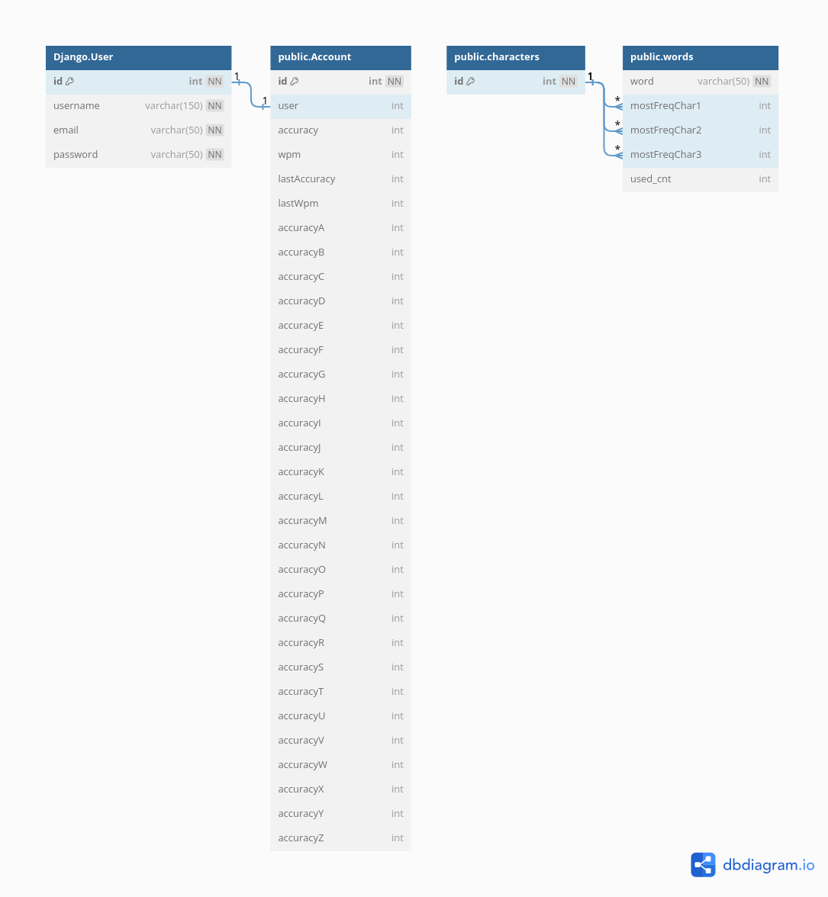

# Word In Word Typing Web Applaication
<a href="https://word-in-word.onrender.com/"></a>

<br>

## table of contents
- [What is Word In Word ?](#what-is-word-in-word-)
- [But what makes our site special ?](#but-what-is-the-difference-between-word-in-word-and-other-typing-applications)
- [How does Word In Word work?](#how-does-word-in-word-work)
- [Technical Information](#technical-information)
    - [Database](#database)
    - [Dependencies](#dependencies)
    - [Deployment](#deployment)
    - [Demo Link](#demo-link)
    
## What is Word In Word ?
- Welcome to Word In Word, a user-friendly web application designed to create an optimal environment for honing your typing skills.
- With its simplicity and ease of use, Word In Word is crafted to assist you in enhancing both your typing speed and accuracy.

## But what is the difference between Word In Word and other typing applications?
- To kick things off, Word In Word is all about fun! 😊
- Beyond the general goal of boosting your typing speed and accuracy, we stand out by emphasizing improvement in each individual letter. Our unique approach prioritizes words containing the specific letter you aim to enhance.
- Our main focus revolves around tailoring sets of words that give prominence to the letters you find least accurate in your typing attempts.

## How does Word In Word work?
- First and foremost, registration is a prerequisite for accessing the application's features.
- Every user is assigned a distinctive Username and a unique Email for their account.
- Following the sign-up process, you can initiate your typing practice sessions.
- Tailor each practice session by selecting the number of words you wish to type and setting a maximum time limit.
- Upon completion, your results will be displayed, allowing you to compare them with your average performance.
- Furthermore, on your profile page, you can track the accuracy percentage for each letter in your typing exercises.

## Technical Information
- Word In Word stands as a web application crafted with the Django framework and SQLITE database, orchestrating backend functionalities, including:
    - User Authentication
    - Data Storage
    - Data Retrieval
    - Data Manipulation
    - Data Validation
    - Data Security
    - Data Presentation
- The frontend boasts a sleek design, incorporating HTML, CSS, and JavaScript to ensure an intuitive and user-friendly interface.
- Elevating the typing functionality, JavaScript takes the reins to capture user input, compare it with anticipated characters, and compute both accuracy and typing speed.


                                                                
### Database
- The application uses SQLite as the database to store user information.
- The Core of the application is words and letters, which are stored in the database to be used in the typing exercises based on the user's preformance and the letters they need to improve.
- Every word is related to the 3 most frequent letters in it and retrieved based on the user's preformance in these letters and the number of times this word was typed by a user.
- The application database has 9000 words all listed in three files:
```
    long.txt
    medium.txt
    short.txt
```
- Moreover, I provided 3 files that contains bad words to be used to filter the words that are not suitable for the application.
- The application uses two scripts to fill the database with the words and to filter the bad words:
```
    addWords.py
    delWords.py
```
- The application uses the Django ORM to interact with the database and retrieve the data needed for the typing exercises.
- The application uses the Django authentication system to handle user registration and login.
- User account contains the user's username, email, password, and the user's preformance in the typing exercises.
```
    Accuracy (percentage of correct letters in the typing exercises)
    Speed (WPM)
    Last typing exercise date
    Accuracy for each letter
```
- And finally, this is the Database Diagram made using [dbdiagram.io](https://dbdiagram.io/):



### Dependencies
- The most important dependencies used in the application are:
    - Django
    - Python-dotenv
    - Django-extension
    - Django-mathfilters
- All the dependencies are listed in the requirements.txt file.
you can install them using the following command:
```bash
pip install -r requirements.txt
```
### Deployment
- Database deployment:
    - In the development phase, the application uses the SQLite database stored locally.
    - In the production phase, the application uses the PostgreSQL database stored in the Supabase cloud.
- Application deployment:
    - The Django application is deployed using [Render](https://render.com/).
    - the **build.sh** script is used to build the application and install the dependencies.
### Demo Link
- You can access the application using the following link:
    - [Word In Word](https://word-in-word.onrender.com/)